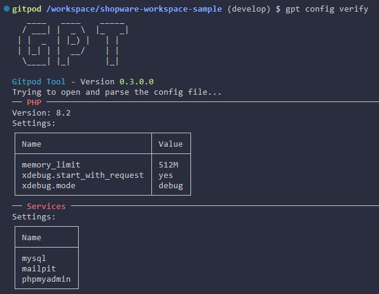

# Config Command

Currently the config command only checks if your current `webdev.yml` is readable and valid. So if you execute `webdev config` you should see the following output:

This is a summary of the settings you have set in your configuration file.