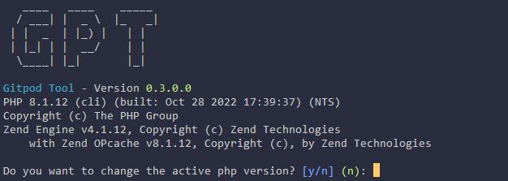

::: warning
Only available in DevContainer mode
:::

# PHP Command

The purpose of the php Command is to change the php version on the fly, change php settings and persist them so that they are available the next time you start the workspace.

## Show the current PHP Version
With the command `webdev php version` you can see the current PHP Version.



## Selecting a PHP Version
With the same command as above, `webdev php version`, you can not only see the current active version but also you will get asked if you want to change it. Answer the question with `y` and the following list will be shown:


Use the arrow keys to select the new version and press enter. WebDev will now switch to the new version. Additionally it will be saved in the `.webdev.yml` file and will be used the next time you start the workspace.

## Changing a PHP Setting
With the command `webdev php ini set <setting> <value>` you can change a PHP Setting. The setting will be saved in the `.webdev.yml` file and directly applied.


## Changing Xdebug mode

::: info
This section will only handle the command itself, a complete documentation on how to set it up and use it in different IDE´s and Tools can be found ADD LINK HERE
:::

With the command `webdev php xdebug` the current Xdebug mode will be shown for Web and CLI.


There are multiple statuses that can be shown, which are the following:
- *Unknown* - which means the tool wasn´t able to correctly check if xdebug is even installed. Make sure the `/phpinfo` page shows that xdebug is installed
- *Not installed/inactive* - Means that Xdebug has not been installed

The rest of the statuses are according to the possible Xdebug modes which are explained in [Xdebug Documentation](https://xdebug.org/docs/all_settings#mode) but their usage are also included in the Debug Documentation.

Following the same principle as every other command it now asks if we want to change the setting and if we type in `y` then it will ask for Web and CLI which new setting should be used.


## Install additional packages

We mostly want to use the same base image for all of our PHP based projects but there might be cases where a project needs a special package installed like `php-soap`. That´s why the command `webdev php packages` has been added.
 With that command we can install additional packages and persist them during workspace restarts.

Initially it shows all packages that are currently installed. Press enter to continue or use the up and down arrows to scroll through that list.


After you have answered the quest `Do you want to install other packages` with yes then it will check first if it finds some commonly used packages that are not installed yet and asks if we want to install one of them.


With the space key we can one or multiple packages that we want to install


After we have selected that packages we want, or skipped that step, it will ask if we want to install other packages that were not listed


We can now enter one or multiple packages, separated by a space, that we want to install. In this example we wanted to install `php-soap`. It is important to note that we don´t need to add a specific php version number to the package name, like `php8.2-soap` as the Tool will always try first to install the php version specific package before trying to install a generic one.


## Restoring PHP Settings

With the command `webdev php restore` the selected PHP Version and Settings will be restored. This command should be executed within your `.webdev.yml`. As example, you can see the following `.webdev.yml` file:

```yaml:line-numbers {1}
tasks:
    - name: Docker Services and Shopware Install
      before: |
        webdev php restore
      init: |
        webdev services start --detached &&
        gp ports await 3306 &&
        webdev shopware install_demo
      command: |
        gp sync-done shopware-install &&
        webdev services start
```

As you can see in line 4, the command `webdev php restore` is executed before we start the services or executing the install script. So make sure to commit changes to `.webdev.yml` if you want to keep the changes persisted.