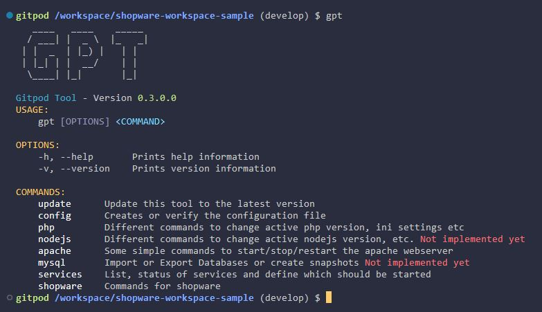
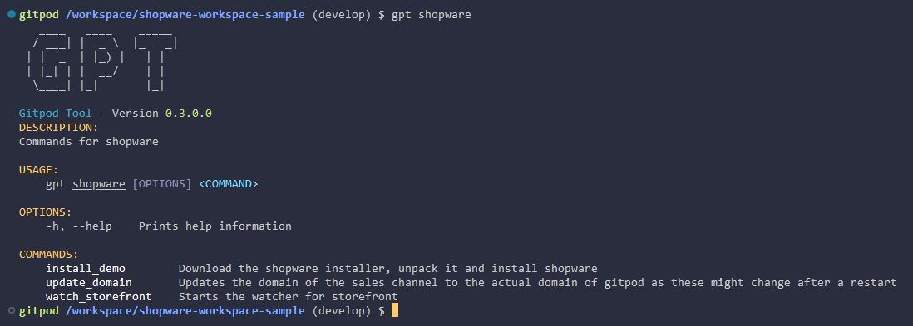
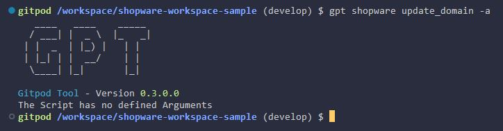

# Extensions

## How does it work?
WebDev can be extended via shell scripts. This means it scans a certain directory and looks for *.sh files.

## Locations

The default folder that will be scanned for extensions is `.devcontainer/scripts`. Additional folders can be defined within ´webdev.yml` configuration file. Check the [Reference section](/reference/shell-scripts) to see on how this can be done.

## Advantage
While most systems have a build-in console with commands, you may need to add custom shell scripts that execute cronjobs, init your system (composer install, npm/yarn install etc.), run tests, load demo data or do some stuff after a branch change. So after a while you might have a dozen of these scripts and while for some developers it might be easy to identify which script does what, not all of them know it. Another thing is that your scripts might use arguments, so that you need to take a look inside the script to check which it has and for what purpose.
Here is the advantage of WebDev. It scans the scripts and make them executable like they are a part of this tool. You can add descriptions and the different arguments it requires. So then when you execute `webdev` they will be listed and are easy to use for everyone.

## Example

The following example script is taken from the [WebDev Shopware sample](https://github.com/Derroylo/shopware-workspace-sample).

```bash:line-numbers {1}
#!/usr/bin/env bash

# Infos for WebDev
#
# webdevBranch: shopware
# webdevBranchDescription: Commands for shopware
# webdevCommand: update_domain
# webdevDescription: Updates the domain of the sales channel to the actual domain of gitpod as these might change after a restart

export APP_URL="https://shopware.dev.localhost";
echo "UPDATE shopware.sales_channel_domain SET url = '$APP_URL' WHERE url LIKE 'http%';" | mysql -uroot -pwebdev --protocol tcp;
```

When we execute now `webdev` we get the following result:

The command "shopware" is not build-in but rather added via the shell script above with it´s description. When we now enter `webdev shopware`

it can be seen that we have Sub-Commands for our Shopware command. These can now be executed like `webdev shopware update_domain` etc.

To check which arguments our scripts accept, we just need to type `webdev shopware update_domain -a`


## Creating your own extension
As we know, everything starts with an "Hello World!" example. Create a new file called `hello_world.sh` in the directory `.devcontainer/scripts` and put the following into it

```bash:line-numbers {1}
#!/usr/bin/env bash

echo "Hello World!"
```

When you try now `webdev` it doesn´t list our new command. That´s because we need to tell WebDev under which command our script should be executed. So make the following changes

```bash:line-numbers {1}
#!/usr/bin/env bash

# webdevCommand: hello_world

echo "Hello World!"
```

Now it is listed and we can call it via `webdev hello_world`. To let others know what our new script does, add an informative description.
```bash:line-numbers {1}
#!/usr/bin/env bash

# webdevCommand: hello_world
# webdevDescription: My first extension for WebDev

echo "Hello World!"
```

So far so good. This works great but can get messy if you have lot´s of commands. The solution is to create a "branch" which is a collection of commands. Similar as you have seen in the example above with the shopware commands.

```bash:line-numbers {1}
#!/usr/bin/env bash

# webdevBranch: example
# webdevBranchDescription: Some examples
# webdevCommand: hello_world
# webdevDescription: My first extension for WebDev

echo "Hello World!"
```

In the example above we created a new branch called "example". If we add now more files to this branch, they all will be listed with `webdev example`. That is a good way to categorize your commands.

Check the Reference on more infos about the comments and how to add arguments.