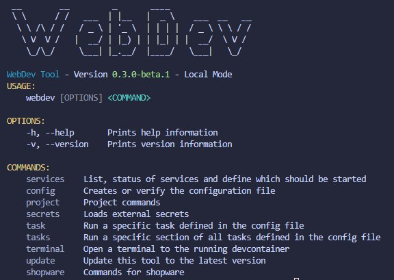

# CLI

Before going into the different commands for the CLI, there is an important info on how the tool works. 

Usually when executing the command within the terminal, you will see something like this:

Under the headline, you can see the version of the tool and the current Mode of the tool. The mode defines which commands are currently available to you. Local mode means you are executing the tool within a "normal" terminal and outside of a container. When it shows "DevContainer Mode", it is executed within a container so you could change the php version etc., which is currently not possible when executing the command outside of it.

All command details have a badge in which mode these commands are available.

::: info
This "limitation" will be changed in one of the next releases to make the tool easier to use.
:::