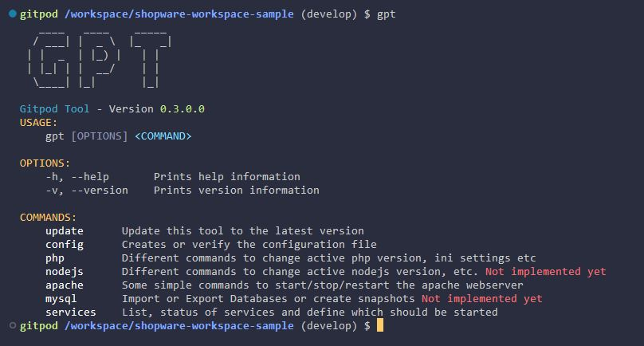
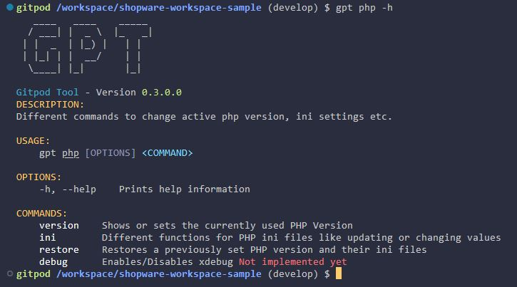

# Usage

If you followed the installation instructions correctly, or used one of the sample workspaces, then you should be able to see the following output when using the command `gpt` in your terminal

As any other linux terminal command you can see which options and commands are available to you. The same works for different commands like `gpt php -h`

This way you can look through each command and see what it does and which options are available.