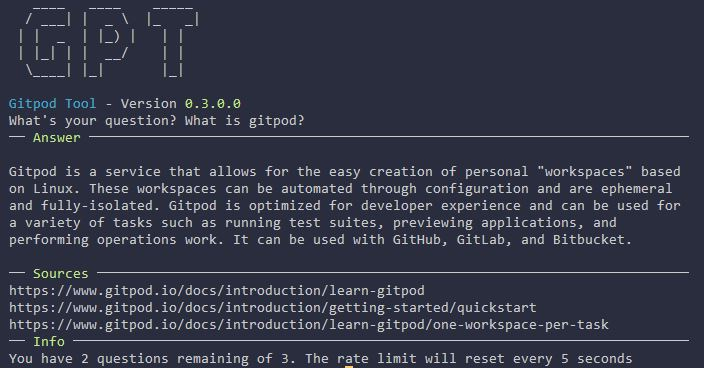

# Ask Command <Badge type="info" text="since v0.4.0" />

This command provides the possibility to ask the Gitpod Ai questions, similar to ChatGPT, just only for questions related to gitpod. In the future this documentation might be included too, so that you can ask questions about GPT too.

## Ask a question <Badge type="info" text="since v0.4.0" />
With the command `gpt ask` you will be prompted to enter your question.

In this example i asked "What is gitpod?" and the answer is divided into three sections. The first one is the answer itself, the second one gives some links related to the given answer and the last one shows the rate limit. With the rate limit it is limited on how many questions you can ask in a specific timeframe.