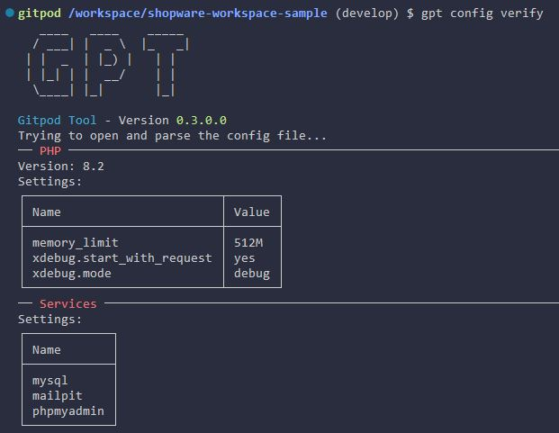

::: danger
This Documentation is currently being rewritten for WebDev, which is the successor of GPT (for which this docs have been written), as Gitpod Classic will be shutdown in the next few weeks.

The Release of WebDev is currently planned within the first two weeks of september.
:::

# Config Command

Currently the config command only checks if your current `.gpt.yml` is readable and valid. So if you execute `gpt config` you should see the following output:

This is a summary of the settings you have set in your configuration file.