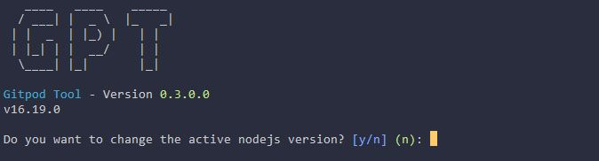

# NodeJS Commands <Badge type="info" text="since v0.4.0" />

With this command you can change the currently active NodeJS version.

## Show the current NodeJS Version <Badge type="info" text="since v0.4.0" />
With the command `gpt nodejs version` you can see the current NodeJS Version.

## Selecting a NodeJS Version <Badge type="info" text="since v0.4.0" />

With the same command as above, `gpt nodejs version`, you can not only see the current active version but also you will get asked if you want to change it. Answer the question with `y` and the following list will be shown:

Use the arrow keys to select the new version and press enter. GPT will now switch to the new version. Additionally it will be saved in the `.gpt.yml` file and will be used the next time you start the workspace.