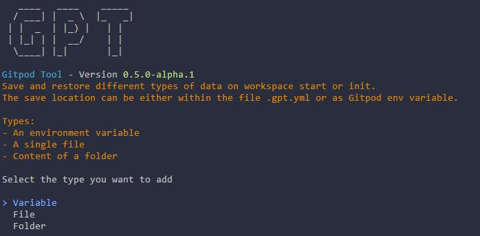

::: danger
This Documentation is currently being rewritten for WebDev, which is the successor of GPT (for which this docs have been written), as Gitpod Classic will be shutdown in the next few weeks.

The Release of WebDev is currently planned within the first two weeks of september.
:::

# Persist Commands <Badge type="info" text="since v0.5.0" />

::: danger
This command will be available in v0.5.0-alpha.1 and is not yet ready for production

The documentation is also WIP and not finished yet.
:::

With this command various persist options are available:
- Save environment variables within the config file or gitpod settings and restore them
- Save files within the config file or gitpod settings and restore them
- Save folders within the config file or gitpod settings and restore them
- Persist files and/or folders between workspace restarts.

For example you can use this command to save ssh keys in your gitpod settings without any tricks as multiline support is not yet implemented within gitpod itself. There are many other applications for the first three options, the only limitation is the max size of 32kB per entry. The last option, to persist files/folders between workspace restarts, comes in handy if you have for example a cache folder which lays outside of the workspace directory and can´t be changed. Then the tool will copy the content of that dir, moves it to the workspace folder and create a symlink. So that your files will still be there after you have restarted your workspace.

## Adding a new entry

Executing the command `gpt persist add` will show you the following selection:

### Variable
This type allows you to define environment variables and their content. It is similar to the gitpod env variables just that the content will be saved within .gpt.yml. The content will be saved in plain text, so don´t put any sensitive data into it.

### File
This type allows you to save the content of a file within .gpt.yml or as gitpod env variable. The content will be base64 encoded so that you can even save and restore files with multiple lines, something that gitpod doesn´t support naturally and can only be achieved with some tricks.

Additionally you can also use this command to persist files between workspace restarts. The way it works is that you define a file and this tool copies that file over to the workspace folder, which is being persisted, and creates a symlink at it´s place. Execute `gpt restore persist` after you have added a new file to persist it and on workspace start, to restore it.

### Folder
Works in the same was as the file type, just for whole folders.

## Removing an entry
With `gpt persist delete` you can select an entry that you want to remove but of course you can do that also by editing .gpt.yml.

## Updating an entry
Use the command `gpt persist update` to update the content of a variable, file or folder that you have created before.