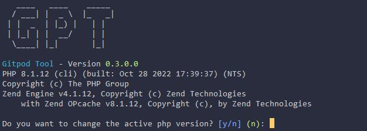
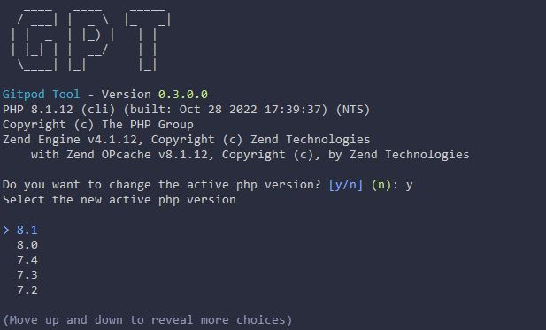
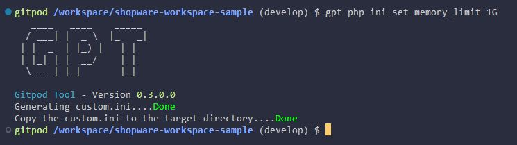

# PHP Command

The purpose of the php Command is to change the php version on the fly, change php settings and persist them so that they are available the next time you start the workspace.

## Show the current PHP Version
With the command `gpt php version` you can see the current PHP Version.



## Selecting a PHP Version
With the command `gpt php select` you can select a PHP Version from the list of available PHP Versions. The list is generated from the PHP Versions that are installed in the workspace. 



After you have selected a new PHP Version, it will be saved in the `.gpt.yml` file and will be used the next time you start the workspace.
The selected version will be saved in the `.gpt.yml` file and will be used the next time you start the workspace.

## Changing a PHP Setting
With the command `gpt php ini set <setting> <value>` you can change a PHP Setting. The setting will be saved in the `.gpt.yml` file and directly applied.



## Restoring PHP Settings
With the command `gpt php restore` the selected PHP Version and Settings will be restored. This command should be executed within your ´.gitpod.yml`. As example, you can see the following `.gitpod.yml` file:

```yaml:line-numbers {1}
tasks:
    - name: Docker Services and Shopware Install
      before: |
        gpt php restore
      init: |
        gpt services start --detached &&
        gp ports await 3306 &&
        gpt shopware install_demo
      command: |
        gp sync-done shopware-install &&
        gpt services start
```

As you can see in line 4, the command `gpt php restore` is executed before we start the services or executing the install script. So make sure to commit changes to `.gpt.yml` if you want to keep the changes persisted.