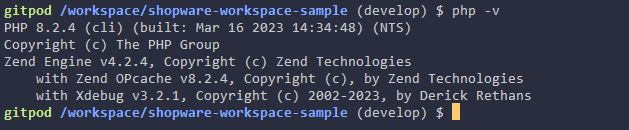

# Installation

When you are using one of my workspace samples, there is nothing to do here as these already include the Xdebug package and webdev will take care of it that it is also installed when you switch to an older version of PHP.

## Check if it is correctly installed
### Via CLI

Enter `php -v` in the command line and check if the output contains Xdebug as shown in the following image:



When the line "with Xdebug" is shown then Xdebug is installed.

### Via Web

When using my workspace samples you can just append "/phpinfo" to the workspace url (execute this command in the terminal for the url: gp url 8080).
If that is not the case then create a simple "info.php" file with the following content:
```php:line-numbers {1}
<?php

phpinfo();
```
and open it in your browser.


When the line "with Xdebug" is shown then Xdebug is installed.

## Installation methods

There are multiple possible installation methods and are covered in the official installation instructions: https://xdebug.org/docs/install

## Installation via APT

Since Gitpod uses Ubuntu for their workspace images, we can simply use `apt` to install Xdebug `sudo apt-get install php-xdebug`. It might show the error message that the package could not be found, so you might need to run `sudo apt-get update` first. When that still doesn´t work then you might need to install it vie PECL, as the package manager might not contain older versions.

Verify that the installation was y with one of the methods mentioned above. If not then follow this guide [guide](#update-php-ini-files)

## Installation via PECL

First check if the PECL package has been installed with simply executing `pecl` in the terminal. If that doesn´t work you need to install it first via `sudo apt-get install php-dev`, as before you might need to update the package manager first with `sudo apt-get update`.

Now install Xdebug with `pecl install xdebug`.

Verify that the installation was successfully with one of the methods mentioned above. If not then follow this guide [guide](#update-php-ini-files)

## Update php ini files
Follow the instructions on how to change the php ini files to load Xdebug: https://xdebug.org/docs/install#configure-php