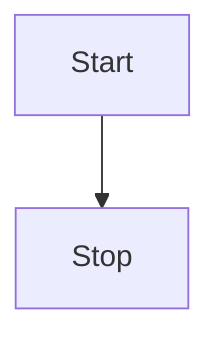

# Init process

The WebDev initialization process is responsible for setting up the development environment when a container starts. This process ensures all necessary services, configurations, and dependencies are properly initialized.

## Process Flow

## Steps Overview

1. **Configuration Loading**: The system reads the `webdev.yml` configuration file
2. **PHP Setup**: Configures PHP versions, extensions, and settings
3. **NodeJS Setup**: Installs and configures Node.js environment
4. **Web Server Configuration**: Sets up Apache or Nginx with proper configurations
5. **Service Management**: Starts required services (MySQL, Redis, etc.)
6. **Custom Scripts**: Executes any custom shell scripts defined in the configuration
7. **Post-Start Tasks**: Runs additional tasks after all services are started

## Configuration

The initialization process is controlled by the `webdev.yml` configuration file. Each section defines specific aspects of the initialization:

- **PHP**: Version, extensions, and configuration settings
- **NodeJS**: Version and package management
- **Services**: Database, cache, and other service configurations
- **Shell Scripts**: Custom initialization commands
- **Tasks**: Post-startup operations