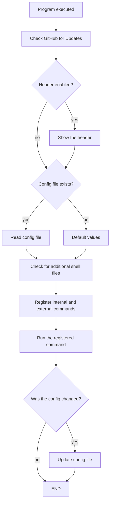

# WebDev execute

This page shows how the tool internally works and in what order it loads everything.

## Process Flow

```mermaid
flowchart TD
    EXEC[Program executed]
    CHECK_FOR_UPDATE[Check GitHub for Updates]
    HEADER_ENABLED{Header enabled?}
    HEADER_SHOW[Show the header]
    CONFIG_EXISTS{Config file exists?}
    CONFIG_LOAD[Read config file]
    CONFIG_DEFAULT[Default values]
    SHELL_FILES[Check for additional shell files]
    REGISTER_COMMANDS[Register internal and external commands]
    RUN_COMMAND[Run the registered command]
    CONFIG_CHANGED{Was the config changed?}
    CONFIG_SAVE[Update config file]
    END

    EXEC-->CHECK_FOR_UPDATE
    CHECK_FOR_UPDATE-->HEADER_ENABLED
    HEADER_ENABLED-->|yes|HEADER_SHOW
    HEADER_ENABLED-->|no|CONFIG_EXISTS
    HEADER_SHOW-->CONFIG_EXISTS

    CONFIG_EXISTS-->|yes|CONFIG_LOAD
    CONFIG_EXISTS-->|no|CONFIG_DEFAULT
    CONFIG_LOAD-->SHELL_FILES
    CONFIG_DEFAULT-->SHELL_FILES

    SHELL_FILES-->REGISTER_COMMANDS
    REGISTER_COMMANDS-->RUN_COMMAND

    RUN_COMMAND-->CONFIG_CHANGED
    CONFIG_CHANGED-->|yes|CONFIG_SAVE
    CONFIG_CHANGED-->|no|END
    CONFIG_SAVE-->END
```